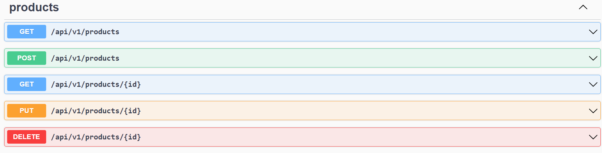
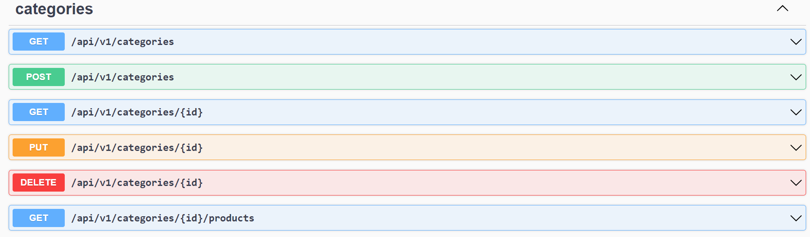
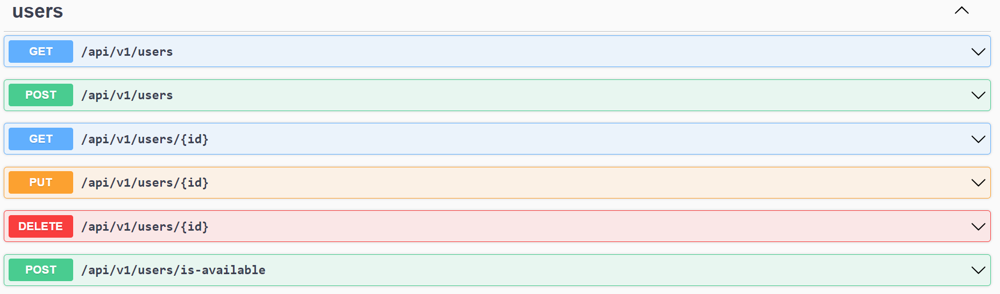

# [EM CONSTRUÇÃO] Platzi Fake Store Quality Assurance - API de testes

## Descrição

O presente repositório se trata de uma projeto de Quality Assurance, sendo que a API 'Platzy Fake Store', disponível por meio do link: https://api.escuelajs.co/docs#/, será submetida à um plano de teste, sendo que a execução será realizada por meio de alguns scripts de automação que podem ser encontrados no presente repositório.

## API Platzi Fake Store

A API Platzi Fake Store emula um comércio fictício, onde é possível realizar operação de:
C (Create / Criação);
R (Read / Leitura);
U (Update / Atualização);
D (Delete / Remoção),

Em endpoints responsáveis pelo gerenciamento de:

- Produtos vendidos na loja;
  
- Categorias de produtos vendidos na loja;
  
- Usuários (tanto clientes, bem como administradores) cadastrados na loja.
  

Não serão validados casos de transações comerciais, tendo em vista que estes endpoints não estão disponíveis na loja.

Além do link do swagger da API Platzi Fake Store disponibilizado no §1º, também é possível consultar a interface frontend deste sistema fictício por meio do seguinte link: https://fakeapi.platzi.com/.


## Ferramentas

As ferramentas utilizadas para a automação dos casos de testes foram as seguintes:

- Jest (framework de testes do NodeJS, com documentação disponível por meio do link: https://jestjs.io/);
- Yup (biblioteca responsável pela construção de schemas para a validação de textos em padrão JSON, disponível por meio do link: https://github.com/jquense/yup);
- Fetch (API para realização de requisições HTTP, disponível por meio do link: https://github.com/node-fetch/node-fetch).

## Instalação

Todas as bibliotecas utilizadas no projeto são executados por meio do NodeJS, portanto, será necessário realizar a instalação do mesmo por meio do seguinte link: https://nodejs.org/en.

Após o NodeJS já se encontrar em sua máquina, dever-se-á instalar as dependências utilizadas para a execução deste projeto.
Para instalar as dependências do NodeJS, abra o terminal ou CMD na raiz do projeto e execute o
seguinte comando:

```
npm install
```

## Execução

Para executar os testes, abra o terminal ou CMD na raiz do projeto e execute o seguinte comando:

```
npm run test
```
